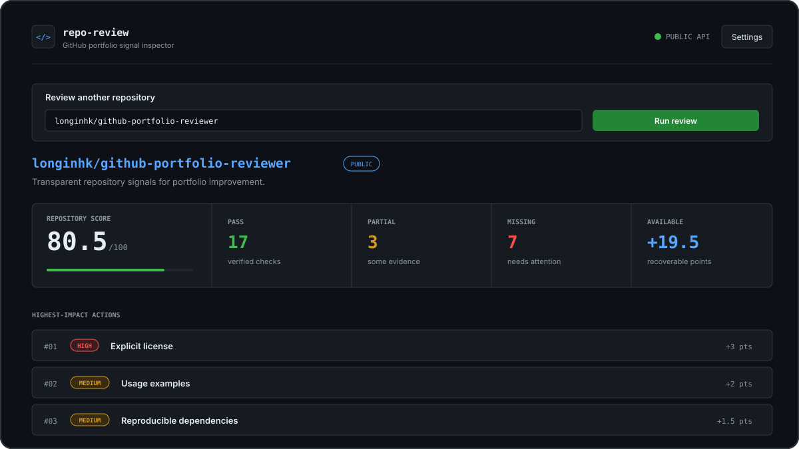

# GitHub Portfolio Reviewer

[](https://github.com/longinhk/github-portfolio-reviewer/actions/workflows/ci.yml)


A Streamlit application that reviews how effectively a public GitHub repository
presents an engineering project to internship recruiters and technical
reviewers. It produces a transparent score out of 100, evidence for every check,
and a prioritized improvement plan.

**No AI API, model key, or paid inference service is required.** Every result
comes from explicit Python rules applied to read-only GitHub evidence.

> The score is a deterministic portfolio-presentation heuristic. It does not
> measure developer ability or code correctness, and its security section is not
> a security audit.



## Features

- Accepts `owner/repository`, a GitHub repository URL, or an SSH clone string.
- Collects repository metadata, the preferred README, the recursive file tree,
  and a bounded allowlist of small text files through the GitHub REST API.
- Reviews metadata, README quality, structure, tests, CI/CD, documentation, and
  basic security signals.
- Verifies selected test, Python, CI, dependency-update, and security signals
  without cloning or executing repository code.
- Shows points, evidence files, thresholds, and next steps behind every result.
- Offers General, Python, AI/ML, data-science, and backend internship review
  focuses. Focus changes recommendation order—not the comparable score.
- Exports deterministic Markdown and JSON reports without raw source content.
- Reuses recent public evidence for five minutes and retries only temporary
  connection or GitHub server failures once.
- Includes dark and light GitHub-inspired themes, check filters, search, and a
  mobile-responsive report.
- Handles missing repositories, invalid tokens, API limits, timeouts, empty
  repositories, missing READMEs, and truncated trees.
- Uses no database and does not intentionally persist GitHub tokens.

## Scoring rubric

| Category | Points | Examples of evidence |
| --- | ---: | --- |
| Repository metadata | 10 | Description, topics, license, archive status |
| README quality | 25 | Detail, setup, usage, badges, visuals |
| Project structure | 15 | Source layout, manifest, `.gitignore`, modularity |
| Tests | 15 | Test presence, implementation evidence, configuration, coverage |
| CI/CD | 10 | Workflow, pinned Actions, permissions, visible status badge |
| Documentation | 10 | Extended docs and project-governance files |
| Security | 15 | Policy, updates, risky filenames, bounded secret scan, lock file |
| **Total** | **100** | Pass = full points, partial = half, fail = zero |

Stars, forks, and issue counts are displayed but never scored. Popularity is not
a reliable measure of engineering quality. CI configuration is not proof that a
workflow passes, and suspicious filenames are not proof that they contain
secrets.

## Architecture

```text
Streamlit UI -> Review service -> GitHub client -> GitHub REST API
                     |
                     +-> Analyzer -> Scoring -> Suggestions
                              +-> Markdown / JSON reporting
                              \_______ domain models _______/
```

The analyzer and scoring rules contain no Streamlit or Requests code, which
makes them deterministic and independently testable. See
[`docs/architecture.md`](docs/architecture.md) for responsibilities and design
tradeoffs.

## External libraries

- **Streamlit** renders the interactive web interface from Python.
- **Requests** sends bounded, timeout-protected calls to GitHub's REST API.
- **Pytest** runs the offline automated test suite during development and CI.
- **pytest-cov** measures which production lines the Pytest suite exercises and
  enforces the documented coverage floor.
- **Ruff** performs linting, import organization, and deterministic formatting.
- **uv** creates the cross-platform lock file and installs that exact environment
  in CI.
- **Setuptools** builds and installs the `src/`-layout Python package.

The project deliberately avoids a GitHub SDK: a small set of REST endpoints is
enough, and a small Requests adapter keeps error handling and response
validation visible. It also deliberately avoids AI SDKs: deterministic rules
make every point explainable, repeatable, fast, and free to run.

## Local setup

Python 3.12 or newer is required.

```bash
python3.12 -m venv .venv
source .venv/bin/activate
python -m pip install --upgrade pip
python -m pip install -e ".[dev]"
```

To reproduce the exact CI dependency environment instead, install uv and sync
the committed lock file:

```bash
python -m pip install uv==0.11.32
uv sync --frozen --extra dev
```

On this development machine, `python3` points to Python 3.9.6 while Python 3.12
is available at `/opt/anaconda3/bin/python3.12`. Use the explicit 3.12 executable
when creating the environment if your machine has the same setup.

## Run the application

```bash
streamlit run streamlit_app.py
```

## Usage

1. Open the local Streamlit URL printed in the terminal.
2. Enter `owner/repository` or a public repository URL.
3. Select a **Review focus**, then select **Run review**. The focus prioritizes
   suggestions but never changes the numerical rubric.
4. Use **Overview** for the score and highest-impact actions, **Checks** to
   filter the evidence-backed results, and **Recommendations** for the full
   improvement plan.
5. Download a deterministic Markdown or JSON report when you want to save or
   share the review.
6. Open **Settings** to change appearance or provide an optional GitHub token.

Try `longinhk/github-portfolio-reviewer` to review this project itself. A review
makes three base GitHub requests plus at most ten bounded text-file requests.
Repeating the same review in one browser session within five minutes uses the
local response cache.

### Optional local token

Copy the example secrets file and replace its placeholder:

```bash
cp .streamlit/secrets.toml.example .streamlit/secrets.toml
```

Never commit `.streamlit/secrets.toml`; it is excluded by `.gitignore`. For
public repositories, use no token or a least-privilege token that can read public
repository metadata. This is a GitHub token only; the application never asks for
an AI service key.

## Quality checks

```bash
python -m ruff check .
python -m ruff format --check .
python -m pytest --cov=github_portfolio_reviewer --cov-report=term-missing
```

The tests inject fake HTTP sessions, block accidental real requests, and enforce
the coverage threshold in `.coveragerc`. This keeps them fast, repeatable, and
independent of GitHub availability or rate limits.

GitHub Actions runs the same three checks for pushes to `main` and pull
requests. The workflow has read-only repository permissions.

## Deploy to Streamlit Community Cloud

1. Push the repository to GitHub.
2. In Streamlit Community Cloud, create an app from that repository and branch.
3. Set the entry point to `streamlit_app.py` and choose Python 3.12.
4. Optionally add `GITHUB_TOKEN = "..."` in the app's Secrets settings.
5. Deploy and test one public repository with and without expected missing
   features.

`requirements.txt` contains `.` so the cloud builder installs this setuptools
project and makes the `src/` package importable. Deployment itself requires the
repository owner's GitHub and Streamlit accounts.

## Limitations

- Only public GitHub repositories are supported.
- Content inspection is intentionally limited to ten small, selected text files
  per review to protect latency and GitHub API allowance.
- Python test inspection recognizes implementation signals but does not execute
  tests or prove correctness.
- Workflow and configuration parsing is deliberately conservative and may
  return partial credit when evidence is ambiguous.
- The high-confidence secret scan is bounded and is not a substitute for Git
  history scanning, dependency auditing, or a professional security review.
- GitHub may truncate file trees for very large repositories; those reports are
  clearly marked provisional.
- Heuristics favor common project conventions and can produce false positives or
  false negatives for unusual ecosystems.

## Project documentation

- [Architecture and design decisions](docs/architecture.md)
- [Contribution guide](CONTRIBUTING.md)
- [Code of conduct](CODE_OF_CONDUCT.md)
- [Change history](CHANGELOG.md)
- [Security policy](SECURITY.md)

## Suggested next improvements

- Let users compare two snapshots of the same repository.
- Add JavaScript/TypeScript-specific content checks beside the Python checks.
- Display live GitHub Actions status when API allowance permits.
- Add optional self-hosted persistence for teams that need report history.

## License decision

No license has been chosen yet. The repository owner should select one that fits
their intended reuse policy and then add the standard `LICENSE` file. This is
intentionally not automated because licensing is an ownership decision.
